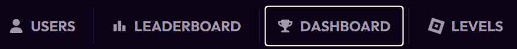
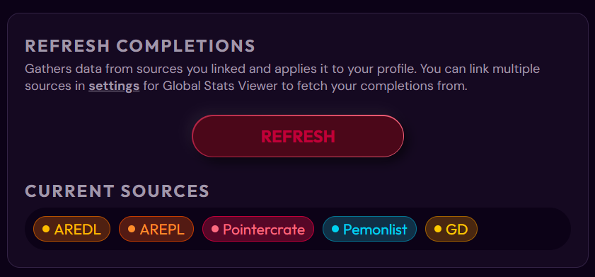
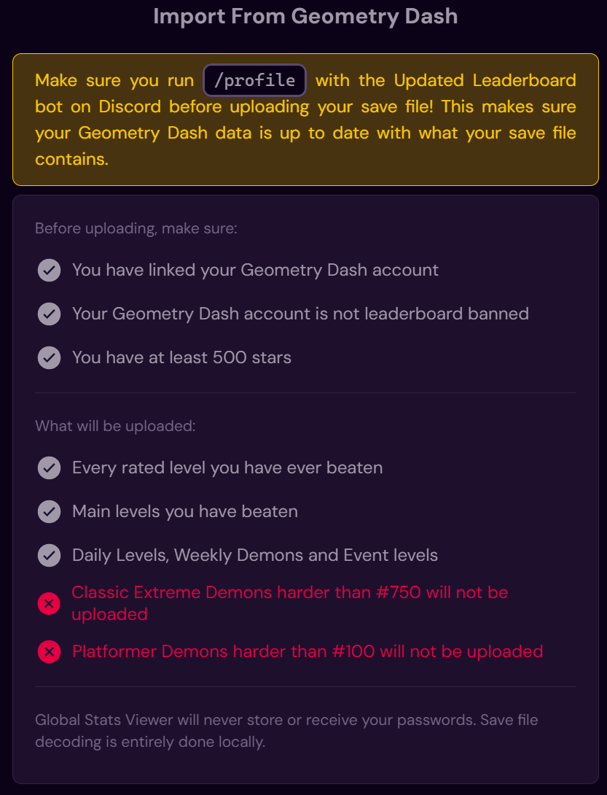
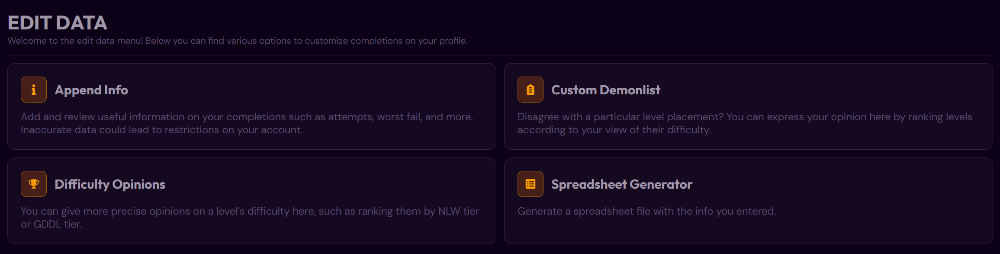
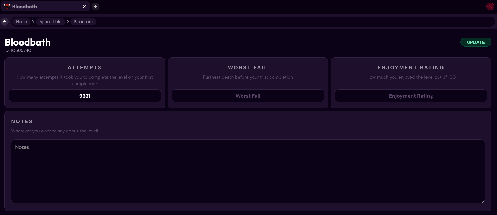
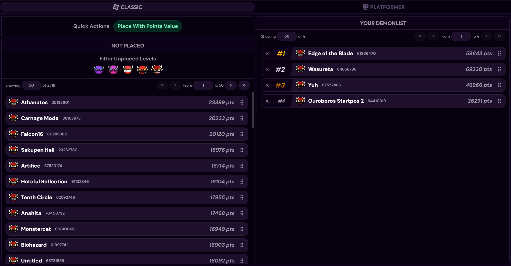
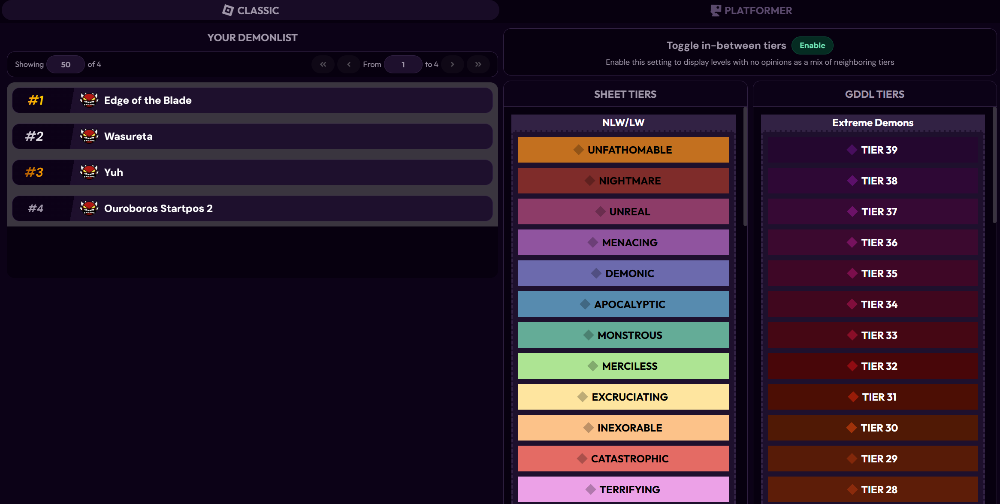

# Completions Management {id=completions-management}
### Add, Manage, and Edit Data to your Completions {id=add-manage-edit}
-# Note: It is reccomended you read the [account linking](https://globalstatsviewer.com/support/account-linking) article first, as this article will assume you have already linked your accounts to your necessary sources
## Dashboard Overview {id=overview}
After linking to all the sources you have, the dashboard is the page you should visit, this will allow you to manage your completions. Below is how a completed Dashboard looks like, but at first, your data might not all be present. On the left side of the screen, a bar will be present that contains all the pages present in the dashboard.

## Refresh Completions {id=refresh-completions}
The second icon on the Dashboard is Manage Completions. This page contains all source fetching, allowing you to import data from GD/Updated Leaderboard, AREDL, Demonlist, and the Pemonlist. On the top left of the page, a button called **Refresh Completions** should show up. Clicking on this requests information from all the mentioned sources, returning to you the most up to date data. Updated Leaderboard data may be a bit out of date unless you run the **/profile** bot command right before running the refresh.

## Import from Geometry Dash {id=gd-import}
Global Stats Viewer allows users to import their completions directly from Geometry Dash. There are a few limits to this however. Levels harder than 750th on the AREDL and 100th on the Pemonlist are not allowed to be directly imported, with additional proof required for submission. Updated Leaderboard linking is required to use the importer, and you must also run **/profile** on the Updated Leaderboard bot right before running the save file import. **If your GD account is leaderboard banned, this feature will not work either**.

## Edit Data {id=edit-data}
Global Stats Viewer allows users to edit and sort their completion data. There are various ways to do such, as shown below.

## Append Info {id=append-info}
Append info allows users to edit their attempts, worst fail, enjoyment rating (of 100), and add notes, this can be done through normal view and a sheet view (less user-friendly but faster editing similar to a spreadsheet). Below is how editing a completion on normal view looks like.

## Custom Demonlist {id=custom_demonlist}
Global Stats Viewer also lets users create their own demonlist of their completions, in their own personal difficulty opinion. There is an option to quickly place levels by points value and editing after the fact or to just create the list from scratch on their own.

## Difficulty Opinions {id=difficulty-opinions}
While placing levels based on how hard you think they are can be useful, there can be instances where a player overrates or underrates nearly all of their accomplishments, meaning that there would need to be more ways to provide difficulty opinions. The NLW/LW tiers and GDDL tiers for Classic and the Difficulty Chart tiers for Platformer can be used to assign difficulty ranges for each level. Instead of dragging levels to each tier, you drag each tier to a level instead. The tiers can after the fact be dragged to emcompass levels above or below it. There is also an option to enable in-between tiers, in case users are unsure about exactly which tier a level belongs in, but they can name the two tiers it could be.

## Spreadsheet Exporter {id=spreadsheet-exporter}
With all the information you would like put into the levels, you can export a spreadsheet of your data. It can be sorted by name, personal difficulty, list difficulty, attempts, date added to GSV, and enjoyement.