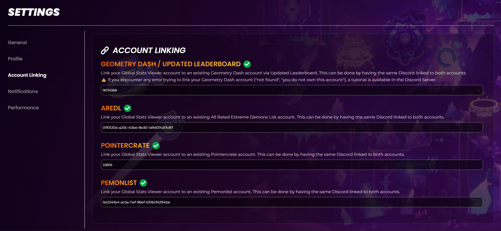
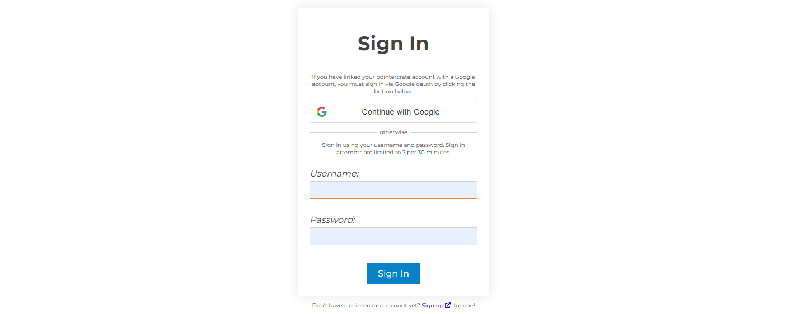
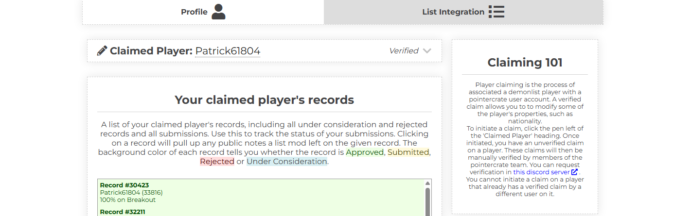
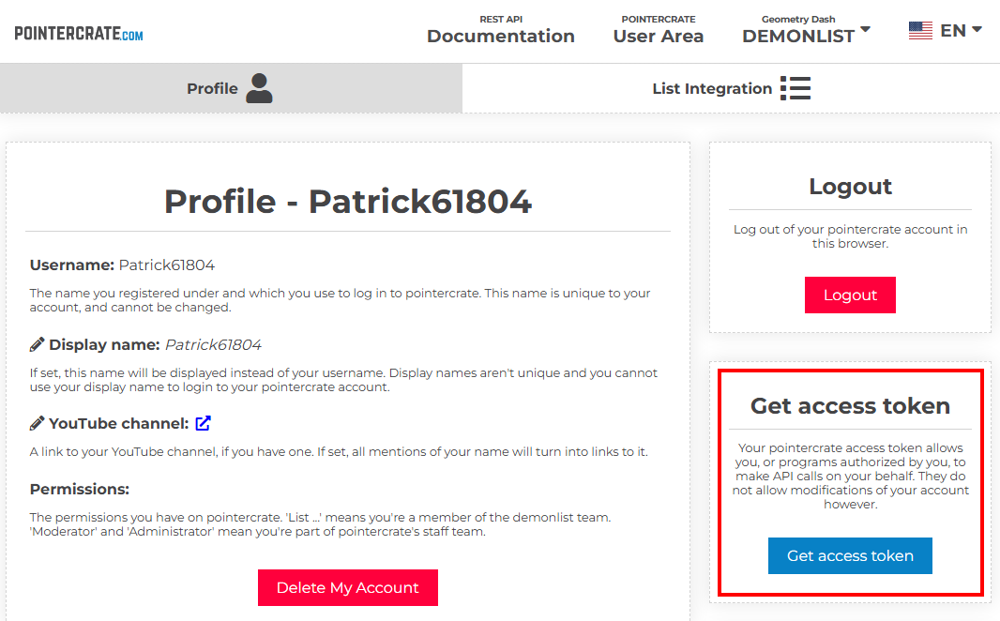
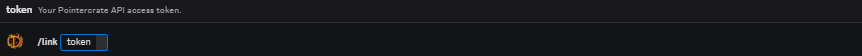

# Accounts & Linking
### How to link to profiles from other sources
-# Note: If your profile was already on the leaderboard, it is possible that some of these links have been pre-filled.

## Geometry Dash / Updated Leaderboard
To link your Global Stats Viewer account to a Geometry Dash account, **you need to be on the Updated Leaderboard to link your Discord account to your GD account.**
If you're not on UL, the website will simply say that your GD account doesn't exist.
Once on UL, you can click on link and Global Stats Viewer will automatically check if you own the account or not. This only works if both are linked to the same Discord account.
Learn how to get on the Updated Leaderboard [here](https://discord.gg/Uz7pd4d). The server has a channel called **[getting-started](https://discord.com/channels/319314852923310102/1253194804804849725)** with a full guide.
Make use to use **/request-verification** in case you have a **"You do not own this Geometry Dash account"** error
If your account is approved, run the **"/profile"** command, going back to the account linking settings and clicking on link should result in your account being linked, given the Discord accounts linked to GSV and Updated Leaderboard are the same.
If you still can't link to your GD account after a UL import, contact a staff member.
## AREDL and Pemonlist
As long as you have your AREDL account and/or Pemonlist account linked with the same Discord as your Global Stats Viewer account, your accounts will be linked after clicking the Link button.
## Pointercrate Demonlist
To link your Global Stats Viewer account to a Pointercrate account, you need to create an account with Pointercrate by accessing the Pointercrate User Area.

If you have not done so already, you must claim your demonlist player on your Pointercrate account. Player claiming is the process of associated a demonlist player with a Pointercrate user account. A verified claim allows you to link your account to Global Stats Viewer.
To initiate a claim, click the pen left of the 'Claimed Player' heading. Once initiated, you have an unverified claim on a player. These claims will then be manually verified by members of the Pointercrate team. You can request verification in [Pointercrate Central](https://discord.gg/sQewUEB)**.
You cannot initiate a claim on a player that already has a verified claim by a different user on it.
**Below is an example of a verified Pointercrate account:**

Once you have had your claim verified, you can copy your Pointercrate access token from the Profile tab. **Do not share this token with anyone!**

Finally, enter your access token in the [Demon List Public Server](https://discord.com/invite/demonlist) bot channel using the command **/link**. Clicking link back on the account linking page should link you with the account.
