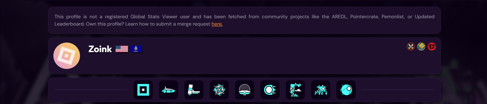

# Registered & Unregistered Users {id=registered-unregistered-users}
### How to create an account & claim an unregistered user.
## Creating an Account {id=creating-account}
You can use the login page to create or login to your **Global Stats Viewer** account.

Using this system, your **Global Stats Viewer** account is now linked to your Discord account. You can manage your overall account (username, bio, etc...) as well as your completions & the data associated with them using this account!
## Unregistered Users {id=unregistered-users}
Unregistered users are accounts that have not been created on the Global Stats Viewer platform.

Unregistered users are those that have not created a Global Stats Viewer account. These accounts are fetched from other websites (such as the AREDL, Pointercrate or UL). The person behind this account has never created a Global Stats Viewer account & this data is only here to provide a more accurate ranking for everyone.
